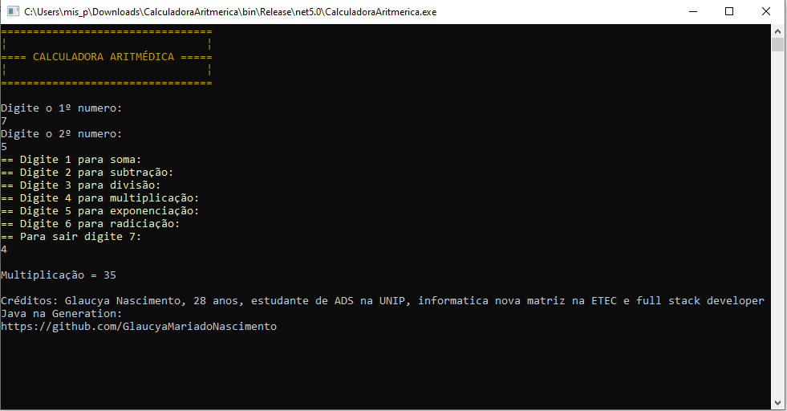

# CalculadoraAritmerica
Site do Software CalculadoraAritmetica
Este software exibe uma calculadora aritmética que permite ao usuario fazer calculos de soma, subtração, multiplicação, divisão, exponenciação e radiciação.

## Exemplo

```
=================================                                      
¦                               ¦                                       
==== CALCULADORA ARITMÉDICA =====
¦                               ¦ 
=================================

Digite o 1º numero: 
5
Digite o 2º numero: 
5
== Digite 1 para soma:      
== Digite 2 para subtração: 
== Digite 3 para divisão:
== Digite 4 para multiplicação:
== Digite 5 para exponenciação:
== Digite 6 para radiciação:
== Para sair digite 7:
4

Multiplicação = 25

Créditos: Glaucya Nascimento, 28 anos, estudante de ADS na UNIP, informatica nova matriz na ETEC e full stack developer Java na Generation:       
e full stack developer Java na Generation:
https://glaucyamariadonascimento.github.io/CalculadoraAritmerica/
```

## _Screenshot_

## _Download_

Baixe o arquivo abaixo. Descompacte na pasta desejada.

🗃🗃 [Download do arquivo .zip](dist/CalculadoraAritmetica.zip)

Execute utilizando o comando: 

```
dotnet CalculadoraAritmerica.dll
```

Ou, se você estiver no Windowns, pode dar um duplo cline no icone do programa.

## Agradecimenros

- [Etec Adolpho Berezin](http://eteab.com.br/cms/)
- [Prof. Ermogenes](https://github.com/ermogenes)
- [Prof. Diego Neri](https://github.com/diegoneri)
- [Dev C#](https://github.com/GlaucyaMariadoNascimento/CalculadoraAritmerica)

---

Todos os direitos reservados. Trabalho de conclusão primeiro semestre Informatica nova matriz.

